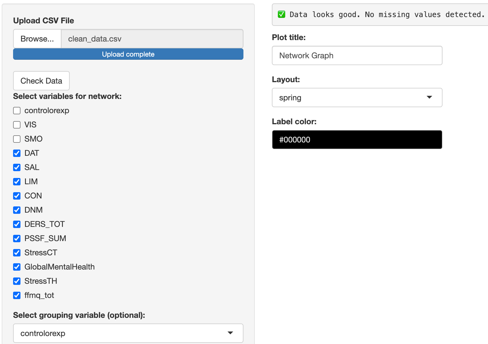
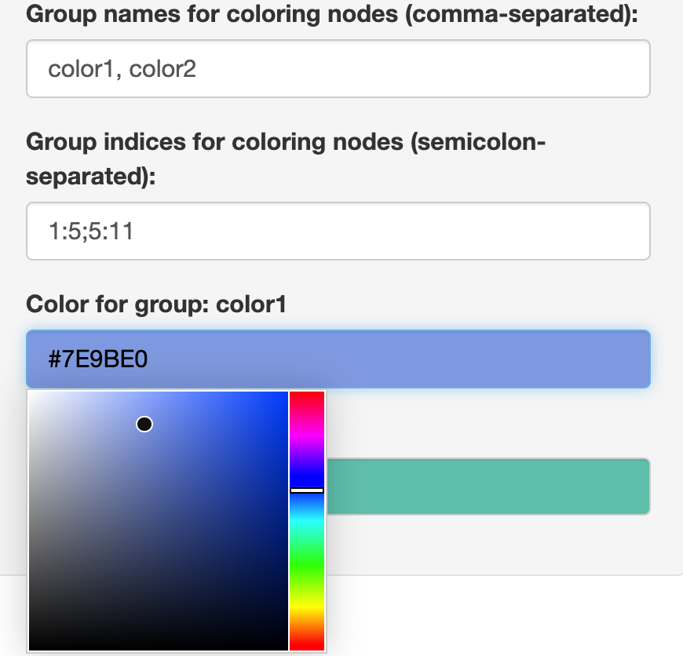
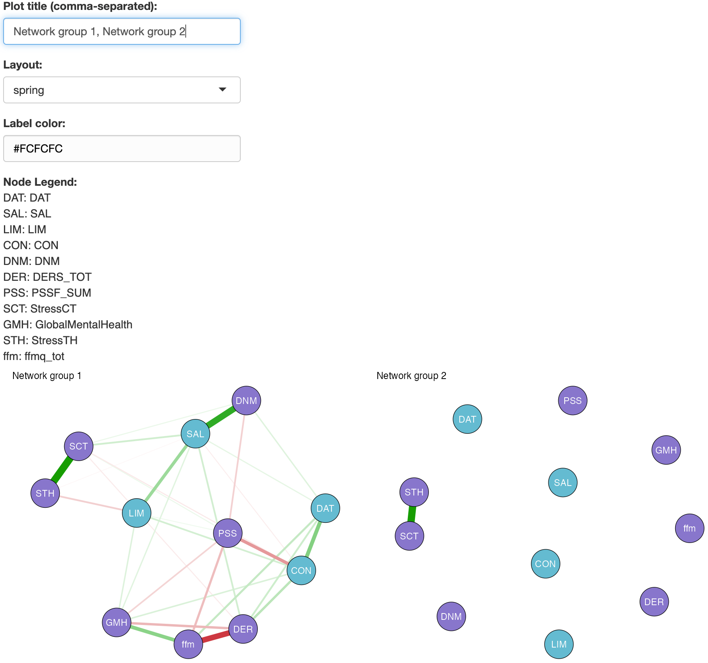
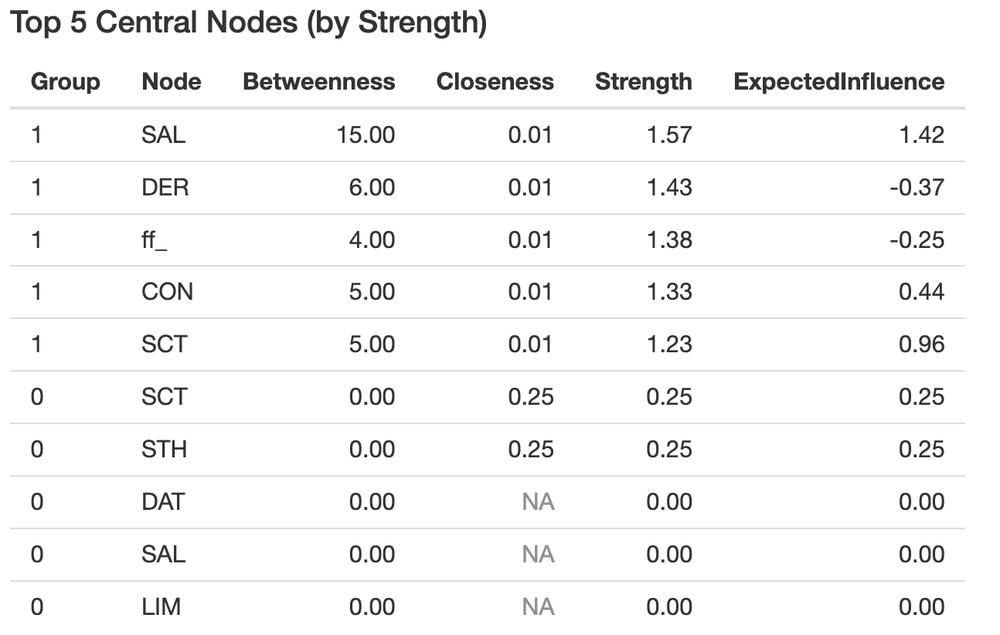
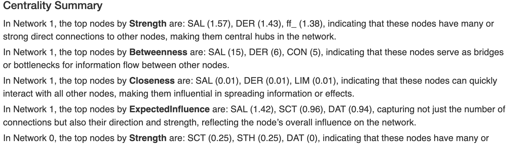

```{r setup, include = FALSE}
knitr::opts_chunk$set(
  collapse = TRUE,
  comment = "#>"
)
```

# Using the `netsum` App for Network Analysis

## Introduction

The `netsum` package provides a Shiny interface for estimating and visualizing psychological or neural networks from user-uploaded data.

### What you will learn

In this vignette, you will learn how to:

-   Install the package
-   Launch and navigate the app
-   Upload and validate your data
-   Estimate networks with multiple methods
-   Customize network plots and color groupings
-   Analyze centrality and read narrative summaries
-   Export plots and tables
-   Validate functionality via reproducible examples

## Installation

Install `netsum` from GitHub or into an **renv** project:

``` r
# From GitHub
remotes::install_github("Programming-The-Next-Step-2025/shiny-networks")

# Or in renv
renv::install("Programming-The-Next-Step-2025/shiny-networks")
```

For local development:

``` r
# From your package root
install.packages(".", repos = NULL, type = "source")
```

## Launching the App

Load and launch:

``` r
library(netsum)
launch_netsum_app()
```

## Using the App

### Uploading Data

Upload a `.csv` via **Upload CSV File** and click **Check Data**. Select nodes and (optional) group variables.

```{r screenshot-upload, echo=FALSE, out.width='80%', fig.cap='Sample data upload screen'}

```

### Estimating Networks

Select an estimation method:

-   **EBICglasso** (default)
-   **glasso**
-   **pcor**
-   **cor**

Adjust `gamma` if needed and click **Estimate Network**.

### Plot Customization

Customize layout, title, labels, and group coloring:

```{r screenshot-plot-customization, echo=FALSE, out.width='43%', fig.cap='Example network plot customization screen'}

```

### Output Plot 

```{r screenshot-plot, echo=FALSE, out.width='80%', fig.cap='Example network plot'}

```

### Centrality Analysis

`netsum` computes:

-   **Strength**
-   **Betweenness**
-   **Closeness**
-   **Expected Influence**

It shows a table of top 5 nodes by Strength and a narrative summary:

```{r screenshot-table, echo=FALSE, out.width='50%', fig.cap='Example centrality table'}

```

The narrative summary appears below:

```{r screenshot-summary, echo=FALSE, out.width='80%'}

```

## Download Options

You can export your results using the buttons in the main panel:

-   **Plot (PNG/PDF)**
-   **Centrality Table (CSV)**


## Testing and Reproducibility

Validate with a simulated network:

```{r imulate-network, echo=TRUE, include=TRUE, results='hide', fig.show='hide', message=FALSE, warning=FALSE}
library(MASS)
library(netsum)

set.seed(42)
Sigma <- diag(4)
Sigma[1, 3] <- Sigma[3, 1] <- 0.8
Sigma[2, 4] <- Sigma[4, 2] <- 0.8

df_sim <- MASS::mvrnorm(200, rep(0, 4), Sigma) |> as.data.frame()
colnames(df_sim) <- c("A", "B", "C", "D")
net_sim <- compute_network(df_sim, vars = colnames(df_sim), method = "cor")
g <- net_sim$networks[[1]]
plot_network(g, title = "Simulated A–C/B–D Network", layout = "spring", label.color = "black")
tab_sim <- get_centrality_table(g)
cat(generate_centrality_summary(tab_sim))
```

## Author and Credits

-   **Author**: Lucas Straub
-   **Repository**: <https://github.com/Programming-The-Next-Step-2025/shiny-networks>
-   **License**: MIT
-   For bug reports and contributions, submit an issue on GitHub.
